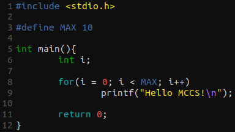

# My custom Gedit color scheme

## Example

## Install

1. Download the `mccs.xml` file:

`$ wget https://raw.githubusercontent.com/jazielloureiro/MCCS-Gedit/master/mccs.xml`

2. Create the Gedit styles directory (if You don't have):

`$ mkdir -p ~/.local/share/gedit/styles/`

3. Move `mccs.xml` to your Gedit styles directory:

`$ mv mccs.xml ~/.local/share/gedit/styles/`

Or, if You've cloned this repository, You can run the install script:

`$ chmod +x install.sh && ./install.sh`
